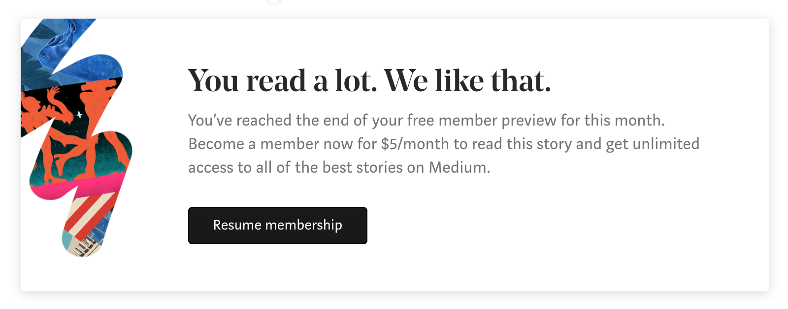

## Let Medium be quiet!

This is a Chrome extension to let your medium be quiet!

## Install

- Open `Developer mode` in top-right
- 首先打开 Chrome 浏览器，并访问 `chrome://extensions/` 地址，来到插件管理页面。
- 在右上角开启 `开发者模式`
- Chrome 从 70 版本开始就只支持 CRX3 格式的插件了，所以如果你的 Chrome 版本号小于 70，可以从 [这里](https://github.com/gongzili456/medium-quiet/releases/download/0.0.1/MediumQuiet-0.0.1.crx)下载打包好的插件文件，并拖拽到浏览器即可安装。

- 如果你的 Chrome 版本大于 70，则需要 clone 本项目的源码，然后点击左上角的 `加载已解压的插件` 即可安装。
